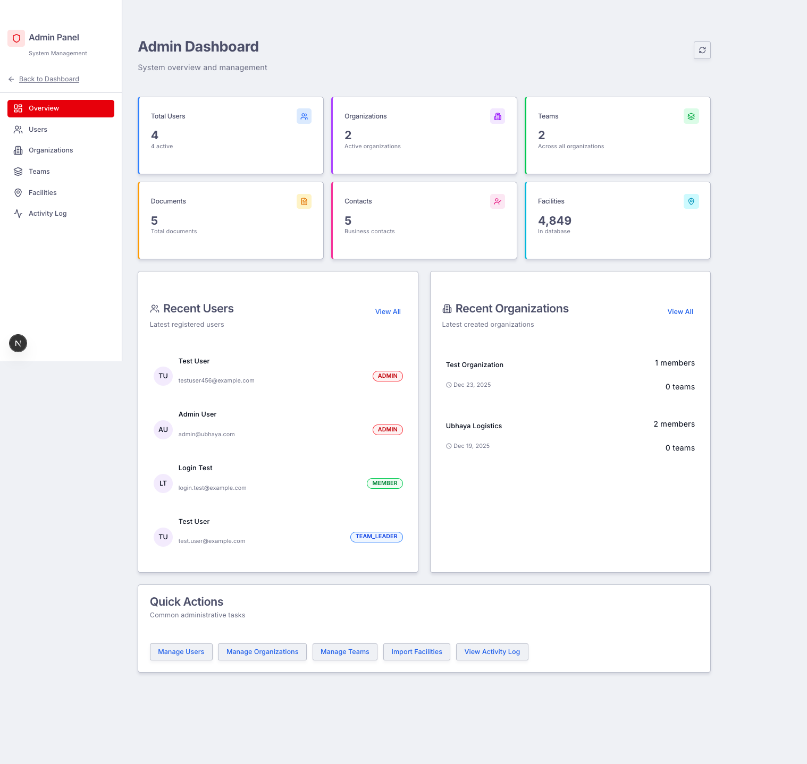
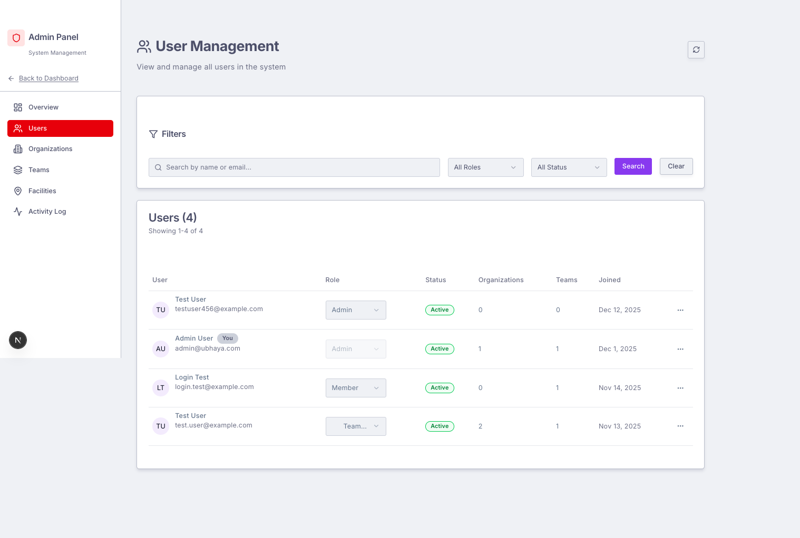
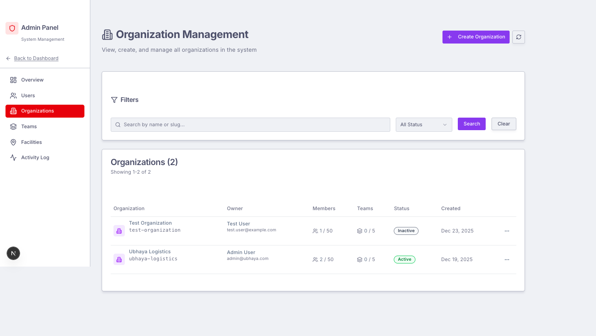
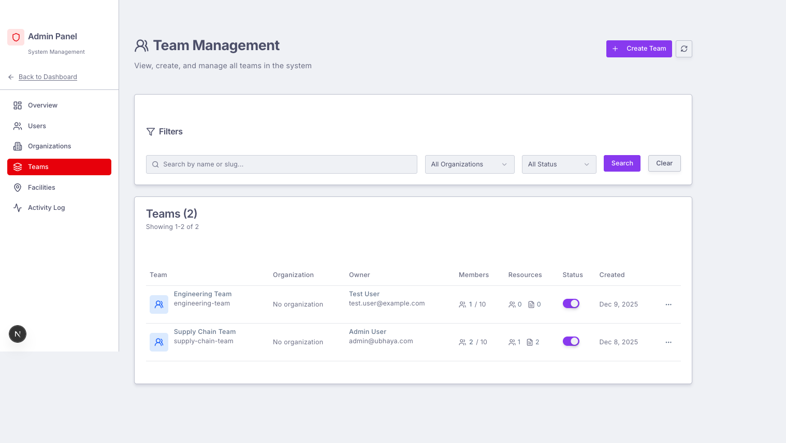
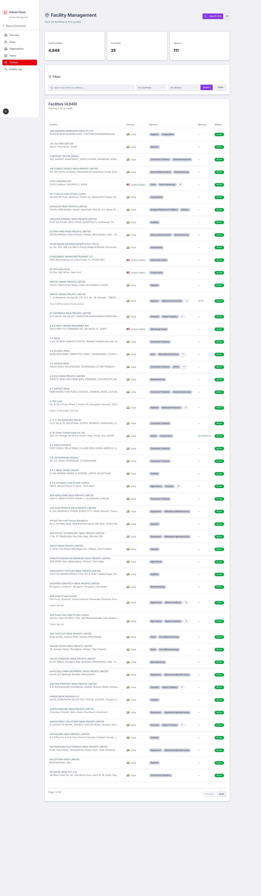
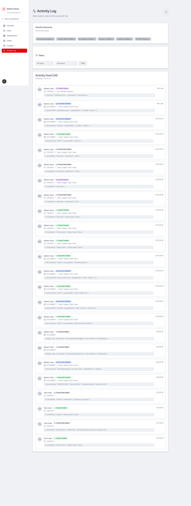

# Client Update Email - Admin Panel

---

**Subject:** Ubhaya Platform Update - Admin Panel Now Available

---

Hi Viola,

I wanted to share an exciting update on the Ubhaya platform development. We've completed the **Admin Panel** - a comprehensive back-office management system that gives you full control over your platform.

## What's New: Admin Panel Features

### 1. Admin Dashboard Overview
A central hub showing key metrics, recent users, organizations, and quick action buttons for common tasks.

### 2. User Management
Full user administration with:
- View all registered users
- Filter by role, status, and organization
- Change user roles directly from the interface
- See organization and team memberships

### 3. Organization Management
Create and manage organizations with:
- Organization details and settings
- Member limits and team limits
- Owner assignment
- Active/Inactive status toggle

### 4. Team Management
Complete team oversight including:
- All teams across the platform
- Team-organization associations
- Member counts and resource tracking
- Active/Inactive status controls

### 5. Facilities Database
A powerful facility management system with:
- **4,849 facilities** across **25 countries** and **111 sectors**
- CSV bulk import capability
- Advanced filtering by country and sector
- Detailed facility information

### 6. Activity Log
System-wide audit trail showing:
- All user actions (documents, contacts, sharing, etc.)
- Activity summaries by type
- Filtering by entity type and action
- Full metadata for each activity

---

## Payment & Deployment

To proceed with production deployment, please settle the following:

| Item | Amount |
|------|--------|
| Remaining development balance | $2,000 USD |
| Hosting credits (DigitalOcean) | $100 USD |
| Domain registration (Namecheap) | $20 USD |
| **Total** | **$2,120 USD** |

Once payment is received, I will:
1. Create a shared Gmail account for managing cloud services
2. Deploy the application to production (DigitalOcean)
3. Purchase and configure the domain (Namecheap)
4. Set up DNS records
5. Configure AWS S3 for file storage (free tier)
6. Set up email service (Google SMTP, scalable to AWS SES)

Please let me know if you have any questions about the admin panel features or the deployment process.

For any future development or new features, I'm available as a freelance developer.

Best regards,
John Paul

---

*Screenshots captured: December 23, 2025*
